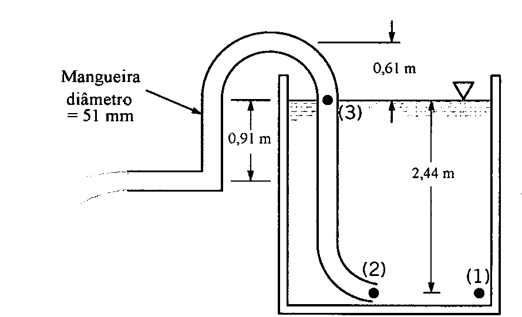

# Mecânica dos Fluidos II – 1º Semestre de 2020 – 1ª Projeto

Água escoa de um reservatório cilíndrico com 6,5 [m] de diâmetro. No instante inicial, t = 0, toda a estrutura pesa 795 toneladas, incluindo a água, o próprio reservatório, etc.
  1. Faça uma tabela com Peso da estrutura × tempo até que não exista mais escoamento no
duto.

  2. Faça uma tabela com zp × tempo em que zp é o nível do reservatório.
  
  3. Faça uma tabela com xp × tempo em que xp é a coordenada x em que a água que sai da
mangueira encontra o solo. Considere que no tempo inicial a água já está tocando o solo. A
coordenada x está identificada na figura a seguir.

Você deverá elaborar um programa computacional para obter o que foi solicitado acima. Os resultados dos
itens 1 a 3 deverão ser impresso em arquivos separados.
